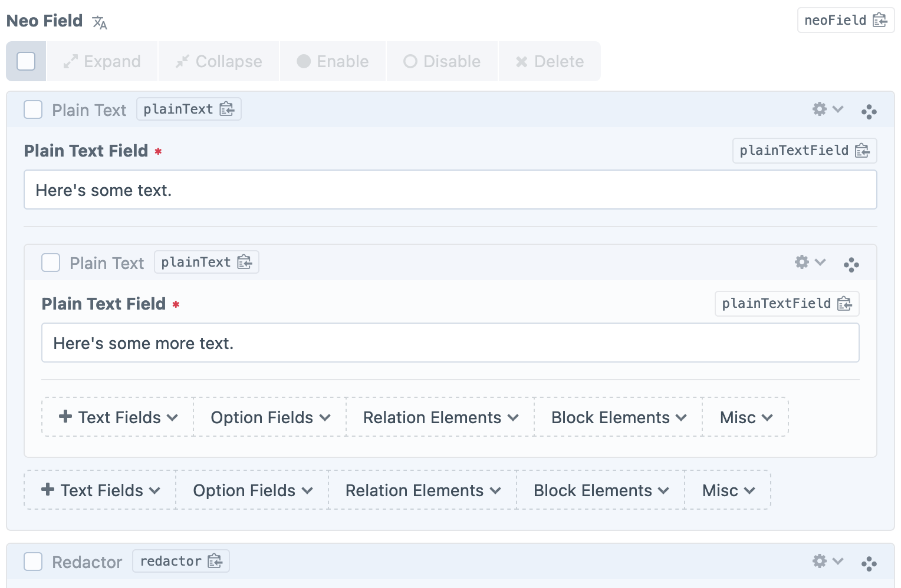
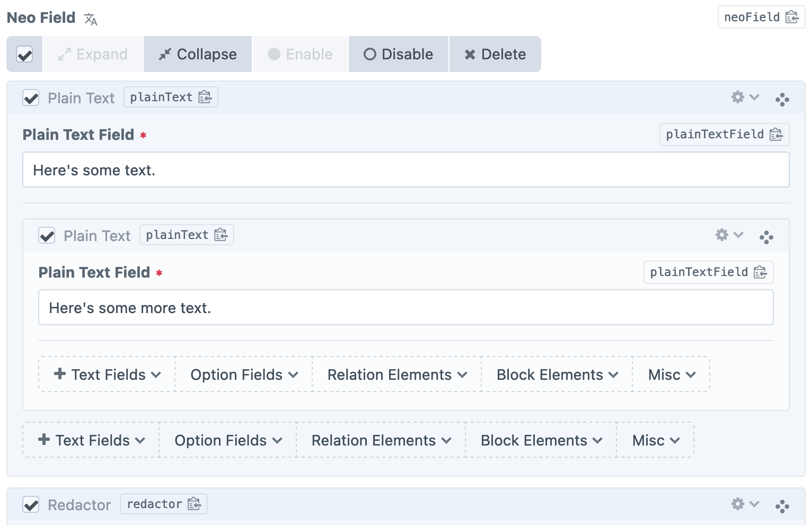
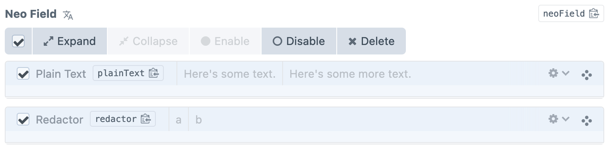
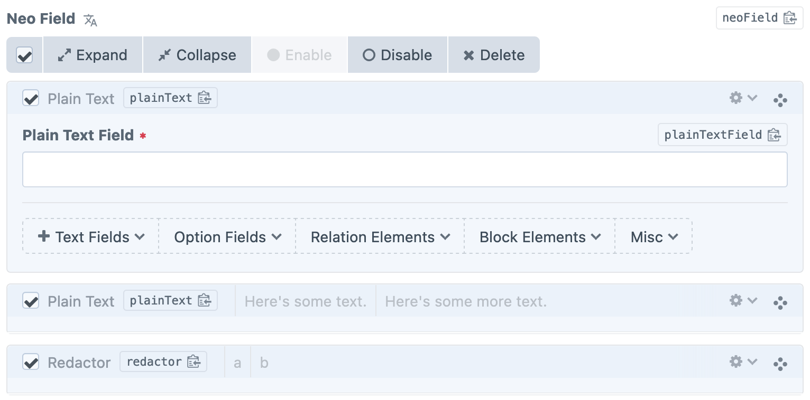

# Batch Actions

A Craft CMS plugin for performing batch actions on Matrix and Neo blocks. All at once, blocks can be expanded, collapsed, enabled, disabled, or deleted, using buttons placed at the top of your Matrix and Neo fields.

From version 1.2.0, Batch Actions supports batch copying Matrix and Neo blocks, and pasting them at the top of the field! Matrix support requires [Smith](https://github.com/verbb/smith) to be installed, while Neo support requires Neo 3.4.0 or later.

## Usage Examples

The action buttons will be enabled/disabled depending on the state of the selected blocks:



Select all checked:



After using the collapse action:



If select all is checked and a new block is added, the new block will be selected:



## Installation

This plugin can be installed from the [Craft Plugin Store](https://plugins.craftcms.com/) or with [Composer](https://packagist.org/).

### Craft Plugin Store

Open your Craft project's control panel, navigate to the Plugin Store, search for Batch Actions and click Install.

### Composer

Open your terminal, navigate to your Craft project's root directory and run the following command:

```
composer require spicyweb/craft-batch-actions
```

Then open your project's control panel, navigate to Settings &rarr; Plugins, find Batch Actions and click Install.

## Requirements

Batch Actions 2.x requires Craft CMS 5.

Batch copying and pasting Matrix blocks requires [Smith](https://github.com/verbb/smith) to be installed.

---

*Created and maintained by [Spicy Web](https://spicyweb.com.au)*
